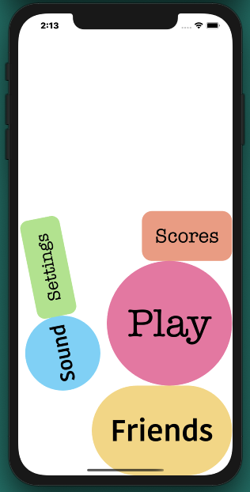

# Dynamic Menu

An example iOS14 app to demo a UIKit Dynamic use of physics for a moving menu

**Technical Info:** \
Xcode 12 project written in Swift 5 for iOS 14\
Swift, UIKit Dynamics

**See Also:** \
[Quickies - a variety of example iOS apps](https://github.com/PepperoniJoe/Quickies)\
 [Make Icons Swiftly - used to generate app icon sets
 ](https://github.com/PepperoniJoe/Make-Icons-Swiftly)

**Author:** \
Marcy Vernon [@MarcyVernon](https://twitter.com/MarcyVernon)

**License:** \
"DynamicMenu" is under the MIT license. See [LICENSE](/LICENSE) for more information.

