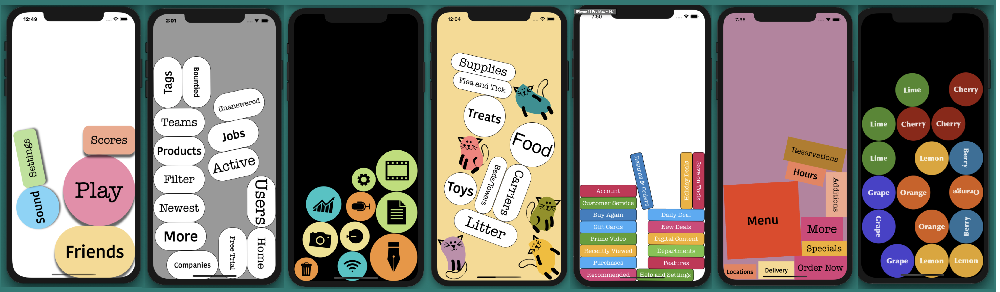

# Dynamic Menu

An example iOS14 app to demo a UIKit Dynamic use of physics for a moving menu. 
The menu freely moves as device is moved. 

Menus can be varied by shape, image, color, border, font, size, background color and shadows. 

Menus are generated from data contained in an array. Each menu item segues to a corresponding view controller of the same name and color.

Tap on a shape to access the corresponding view controller.

**Technical Info:** \
Xcode 12 project written in Swift 5 for iOS 14\
Swift, UIKit Dynamics, Target Action, Storyboard. custom method chaining, AVFoundation

**See Also:** \
[Quickies - a variety of example iOS apps](https://github.com/PepperoniJoe/Quickies)\
 [Make Icons Swiftly - used to generate app icon sets
 ](https://github.com/PepperoniJoe/Make-Icons-Swiftly)

**Author:** \
Marcy Vernon [@MarcyVernon](https://twitter.com/MarcyVernon)

**License:** \
"DynamicMenu" is under the MIT license. See [LICENSE](/LICENSE) for more information.

